# User Guide

> Applies to ChillScreen 1.1.0 for macOS.

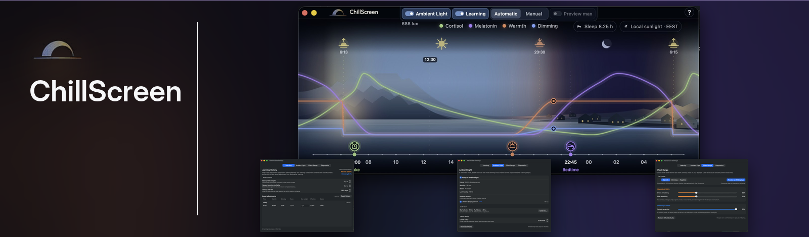

ChillScreen is a macOS menu-bar app that gradually adjusts your screen throughout the day using independently configurable Warmth and Dimming effects.

It can follow your daily rhythm automatically, react to ambient light, learn from your adjustments, or give you direct manual control.

## Quick index

- [1. Getting Started](#1-getting-started)
- [2. Menu Bar Status & Controls](#2-menu-bar-status--controls)
- [3. Daily Cycle](#3-daily-cycle)
- [4. Warmth](#4-warmth)
- [5. Dimming](#5-dimming)
- [6. Automatic Mode](#6-automatic-mode)
- [7. Manual Control](#7-manual-control)
- [8. Ambient Light](#8-ambient-light)
- [9. Learning](#9-learning)
- [10. Effect Range](#10-effect-range)
- [11. Diagnostics](#11-diagnostics)
- [12. Multiple Displays](#12-multiple-displays)
- [13. Launch at Login](#13-launch-at-login)
- [14. Permissions and Privacy](#14-permissions-and-privacy)
- [15. Pay What You Think It’s Worth](#15-pay-what-you-think-its-worth)
- [16. Updating ChillScreen](#16-updating-chillscreen)
- [17. Turning ChillScreen Off](#17-turning-chillscreen-off)
- [18. Troubleshooting](#18-troubleshooting)
- [19. Feedback and Bug Reports](#19-feedback-and-bug-reports)
- [20. Why I Built ChillScreen](#20-why-i-built-chillscreen)
- [Research references](#research-references)

---

## 1. Getting Started

### Requirements

- macOS 14 Sonoma or later.
- Location access is optional.
- Ambient Light features require a compatible light sensor detected by ChillScreen.

### Installation

1. Download the latest `ChillScreen-*.dmg` from the GitHub **Releases** page.
2. Open the downloaded disk image.
3. Drag **ChillScreen** into **Applications**.
4. Open **Applications**.
5. Control-click or right-click **ChillScreen** and choose **Open**.
6. Confirm **Open** in the macOS security dialog.

ChillScreen is currently distributed as an unsigned build. Because of this, macOS may block a normal double-click on first launch.

If **Open** is not available:

1. Try opening ChillScreen once.
2. Open **System Settings → Privacy & Security**.
3. Scroll down to **Security**.
4. Choose **Open Anyway** for ChillScreen.

This is normally required only on the first launch.

Advanced users can optionally verify the download using the SHA-256 file included with each release.

### First setup

1. Launch ChillScreen and click its icon in the macOS menu bar.
2. Open **Daily Cycle**.
3. Set your typical **Wake**, **Evening**, and **Bedtime** times.
4. Choose **Automatic** or **Manual** mode.
5. Optionally enable Location, Ambient Light, Learning, or Launch at Login.
6. Turn ChillScreen **On** from the menu-bar menu.

ChillScreen starts applying an effect only when it is On and the selected schedule calls for Warmth or Dimming.

---

## 2. Menu Bar Status & Controls

ChillScreen lives in the macOS menu bar.

Click the ChillScreen icon to quickly see its current status and access the app's controls.

At the top of the menu, ChillScreen shows:

- whether ChillScreen is currently **On** or **Off**;
- the currently active mode and phase of the day, for example **Automatic · Day**;
- the current **Dimming** and **Warmth** levels;
- the current ambient-light reading in **lux**, when available.

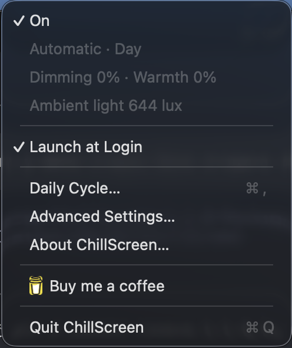

From the menu you can also:

- turn ChillScreen on or off;
- enable or disable **Launch at Login**;
- open **Daily Cycle** for the main daily-cycle view and controls;
- open **Advanced Settings** for deeper configuration;
- open **About ChillScreen**;
- say thanks through **Buy me a coffee**;
- quit ChillScreen.

The menu itself does not switch between Automatic and Manual modes. Those controls are available inside **Daily Cycle**.

---

## 3. Daily Cycle

**Daily Cycle** is ChillScreen's main settings window. It brings your whole 24-hour cycle into one view so you can see how your screen settings relate to your daily routine and local sunlight.

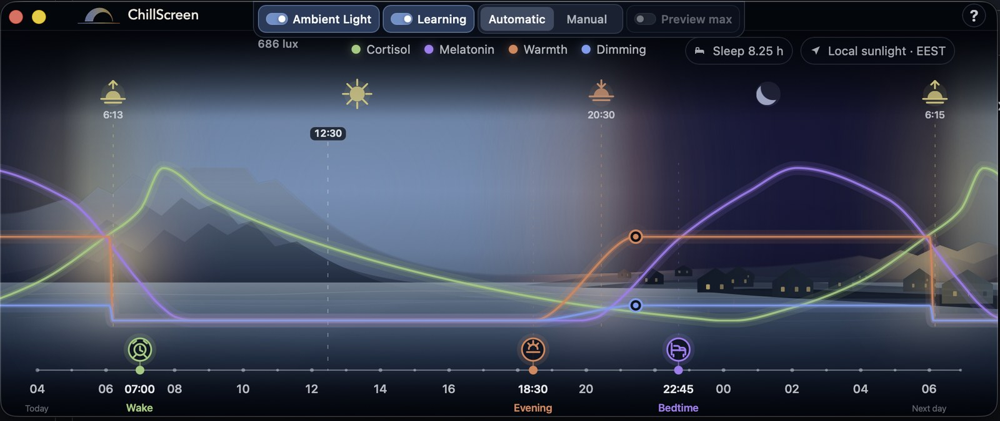

The top of the window gives you quick access to the main operating controls and status, including:

- **Ambient Light** and the current light level in lux;
- **Learning**;
- **Automatic** and **Manual** modes;
- **Preview max**;
- your configured sleep duration;
- local sunlight and time-zone information.

The timeline shows the key points of your daily schedule, including:

- **Wake** time;
- the start of your **Evening** transition;
- **Bedtime**;
- sunrise and sunset when local sunlight is available.

Across the same timeline, ChillScreen displays four curves:

- **Warmth** — orange;
- **Dimming** — blue;
- **Cortisol** — green;
- **Melatonin** — purple.

Warmth and Dimming show how ChillScreen's screen effects change across your day. The Cortisol and Melatonin curves provide circadian reference context alongside your configured schedule.

The Cortisol and Melatonin curves are normalized, research-informed reference profiles. They are not measurements of your individual hormone levels.

The reference curves and the timing relationships shown in this view are informed by research used to study circadian timing, melatonin, cortisol, light exposure, and sleep/wake timing. The studies used for this topic are listed in **Research references** at the end of this guide.

### Editing your schedule

Drag the **Wake**, **Evening**, and **Bedtime** markers horizontally along the time scale.

You can also select a marker and adjust it with the keyboard for finer control.

Automatic and Manual modes keep their own schedule settings. Switching modes restores the values previously saved for that mode.

---

## 4. Warmth

**Warmth** controls how strongly ChillScreen shifts the display toward warmer, redder tones.

Warmth follows its own curve and can transition independently from Dimming. This lets you choose both the maximum Warmth level and how quickly ChillScreen reaches it after the **Evening** point.

In **Manual** mode, use the orange control point on the Warmth curve:

- drag it **up or down** to change the maximum Warmth strength;
- drag it **left or right** to change the transition duration — how long ChillScreen takes to move from the Evening starting point to the selected maximum.

The tooltip next to the control point shows the current values, including **Transition**, **Now**, and **Max**.

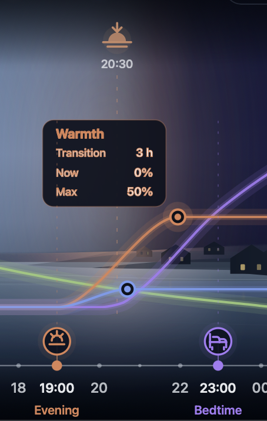

---

## 5. Dimming

**Dimming** reduces the perceived brightness of the display and follows a separate curve from Warmth.

This means the screen can become warmer and darker at different rates, depending on the settings you choose.

In **Manual** mode, use the blue control point on the Dimming curve:

- drag it **up or down** to change the maximum Dimming strength;
- drag it **left or right** to change the transition duration — how long ChillScreen takes to move from the Evening starting point to the selected maximum.

The tooltip next to the control point shows the current values, including **Transition**, **Now**, and **Max**.

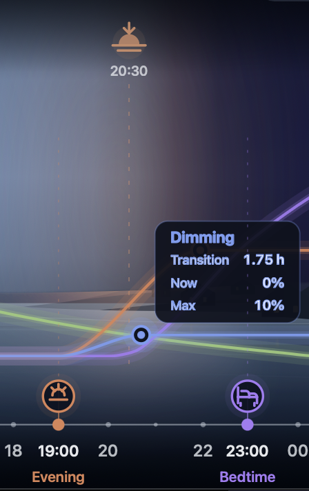

---

## 6. Automatic Mode

**Automatic** mode lets ChillScreen manage Warmth and Dimming for you throughout the day.

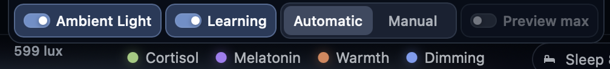

In Automatic mode, the standard Warmth and Dimming controls are managed automatically. You can still adjust **Wake**, **Evening**, and **Bedtime**.

When Learning is enabled, separate adjustment handles become available during the evening learning window. These let you change the current Warmth and Dimming without switching to Manual mode.

Depending on your configuration, the Automatic calculation can take into account:

- your daily schedule and current time;
- local sunrise and sunset;
- **Ambient Light** and the current lux level;
- your locally learned preferences when **Learning** is enabled.

As conditions change, ChillScreen can therefore adjust the active Warmth and Dimming values without requiring you to move the standard Manual controls yourself.

Location permission is optional. When no location has been saved, ChillScreen may request permission to obtain an approximate location for calculating local sunrise and sunset.

If permission is granted, ChillScreen can refresh the stored coordinates on later launches or after wake without repeatedly asking for permission. This allows sunrise and sunset times to update when you travel.

Only coordinates are stored locally. ChillScreen does not maintain a location history.

---

## 7. Manual Control

**Manual** mode gives you direct control over the Warmth and Dimming curves.

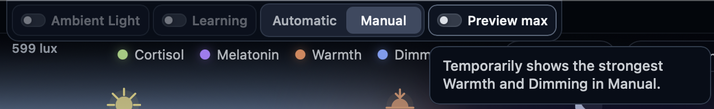

This is useful when:

- you want a specific transition or maximum effect;
- the current environment is unusual;
- you are experimenting with a comfortable setting;
- you want to preview how different settings feel.

Warmth and Dimming remain independent, so each curve can use its own maximum strength and transition duration.

Use **Preview max** to temporarily show the strongest Warmth and Dimming configured in Manual mode. This lets you check the maximum effect without changing the current point in the daily cycle.

---

## 8. Ambient Light

Open **Advanced Settings → Ambient Light** to configure sensors and calibration.

**Ambient Light** lets Automatic mode respond to the actual light level around your Mac in addition to the daily schedule. After the Evening period begins, a darker room can add extra Dimming and Warmth on top of the base Automatic profile.

Ambient Light affects Automatic mode only. Its controls are unavailable while Manual mode is selected.

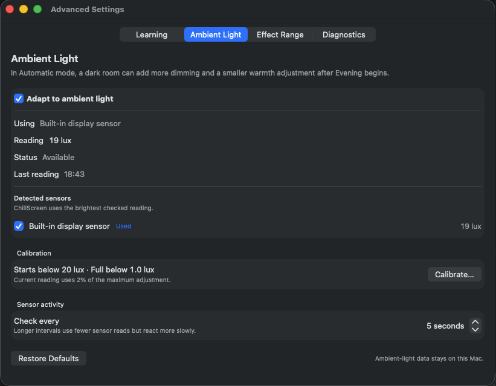

Turn on **Adapt to ambient light** to enable this behaviour.

The status area shows which sensor ChillScreen is using and whether it is available:

- **Using** — the sensor currently selected for adaptation;
- **Reading** — the current measured room light in lux;
- **Status** — whether the sensor is available;
- **Last reading** — when ChillScreen last received a sensor value.

Under **Detected sensors**, you can choose which available sensors ChillScreen may use. When more than one checked sensor is available, ChillScreen uses the brightest checked reading.

### Calibration

The Calibration summary shows the two light thresholds that define when ambient adaptation begins and when it reaches full strength. It also shows how much of the configured maximum adjustment is being applied at the current reading.

Open **Calibrate…** to change these values.

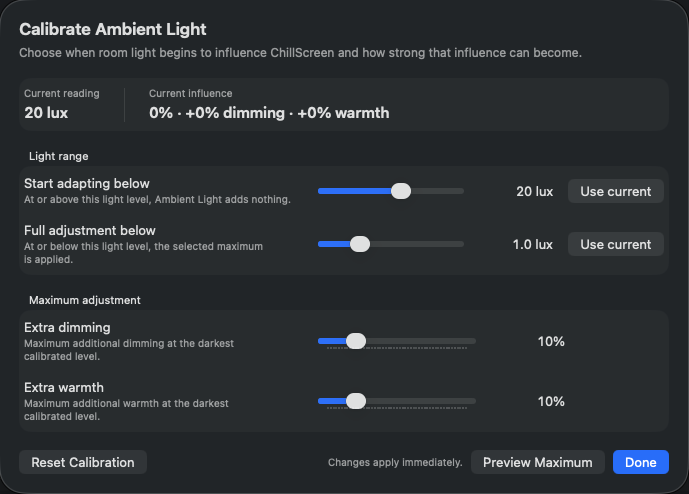

The calibration window is divided into two parts.

#### Light range

**Start adapting below** defines the upper threshold:

- at or above this lux level, Ambient Light adds no extra Warmth or Dimming;
- lowering this value means the room must become darker before adaptation begins;
- raising it makes Ambient Light start influencing the screen in brighter conditions.

**Full adjustment below** defines the lower threshold:

- at or below this lux level, ChillScreen applies the full extra adjustment configured below;
- lowering this value reserves the strongest effect for a darker room;
- raising it reaches the maximum adjustment sooner.

Between the two thresholds, ChillScreen progressively increases the ambient-light influence as the room gets darker.

Use **Use current** next to either threshold to set it to the current sensor reading instead of positioning the slider manually.

#### Maximum adjustment

**Extra dimming** sets the maximum additional Dimming that Ambient Light can add at the darkest calibrated level.

**Extra warmth** sets the maximum additional Warmth that Ambient Light can add at the darkest calibrated level.

These are additions to the base Automatic values, not replacements for the Daily Cycle profile.

The **Current influence** line at the top shows what the present room reading is doing right now: the percentage of the ambient adjustment currently active and the resulting extra Dimming and Warmth.

Use **Preview Maximum** to check the strongest configured ambient-light effect. **Reset Calibration** restores the calibration defaults, and changes apply immediately.

### Sensor activity

**Check every** controls how often ChillScreen reads the ambient-light sensor.

- a shorter interval reacts to room-light changes sooner but performs sensor reads more often;
- a longer interval performs fewer reads but reacts more slowly.

**Restore Defaults** returns the Ambient Light settings to their default values.

Ambient-light data stays on your Mac.

---

## 9. Learning

Open **Advanced Settings → Learning** to view Learning History and model controls.

**Learning** lets ChillScreen use your previous evening adjustments to refine future Automatic recommendations. Learning is optional and all learning data stays on your Mac.

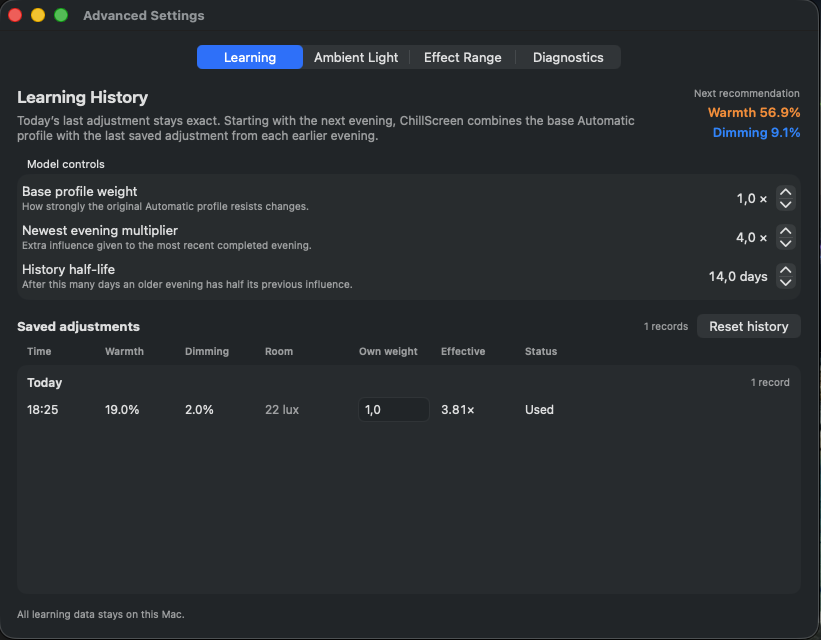

### Teaching ChillScreen your preference

Learning adjustments are available while:

- ChillScreen is On;
- Automatic mode is selected;
- Learning is enabled;
- the current time is between **Evening** and the earlier of **Wake** or 06:00.

During this period, drag the Learning handles vertically to choose the Warmth and Dimming that feel comfortable right now. The display changes immediately.

After you stop adjusting the controls, ChillScreen waits 10 seconds and saves the latest values for that evening. A confirmation appears with an **Undo** button.

Your choice remains in effect for the current evening. ChillScreen uses it when calculating recommendations for future evenings rather than immediately replacing it with an averaged value.

If you make several adjustments during the same evening, the latest saved adjustment represents that evening. Earlier records remain visible in Learning History but are marked as replaced.

Ambient Light adjustments are stored separately from your personal Learning preference. This prevents temporary room lighting from being learned as a permanent preference.

### Learning History

The **Learning History** view shows the saved adjustments that can influence future evenings. Today's most recent adjustment remains exact for the current day. Starting with the next evening, ChillScreen combines the base Automatic profile with saved adjustments from earlier evenings.

The **Next recommendation** in the upper-right corner shows the Warmth and Dimming values currently calculated for the next evening from the available history and model settings.

### Model controls

The three model controls determine how strongly different parts of the history influence that recommendation.

**Base profile weight** controls how strongly the original Automatic profile resists learned changes.

- increase it to keep recommendations closer to the original Automatic profile;
- decrease it to give saved adjustments more influence.

**Newest evening multiplier** gives extra influence to the most recent completed evening.

- increase it when you want the latest evening to matter more than older records;
- decrease it for a more even balance across the history.

**History half-life** controls how quickly older evenings lose influence over time. It is expressed in days: after the selected number of days, an older evening has half of its previous influence.

- a longer half-life keeps older history relevant for longer;
- a shorter half-life makes the model favour more recent behaviour.

### Saved adjustments

Each saved record shows:

- **Time** — when the adjustment was saved;
- **Warmth** and **Dimming** — the values recorded for that evening;
- **Room** — the ambient-light reading associated with the record when available;
- **Own weight** — the individual weight assigned to that record;
- **Effective** — the record's final influence after the learning model applies its weighting rules;
- **Status** — whether the record is currently being used.

Changing **Own weight** lets you increase or reduce the importance of one specific saved adjustment without changing the global model controls.

Use **Reset history** if you want to clear the saved learning history and start learning again from an empty history.

---

## 10. Effect Range

Open **Advanced Settings → Effect Range** to configure the maximum Warmth and Dimming output.

**Effect Range** defines what **100% Warmth** and **100% Dimming** actually mean on your displays. The Daily Cycle and Manual controls then scale lower percentages smoothly within these maximum limits.

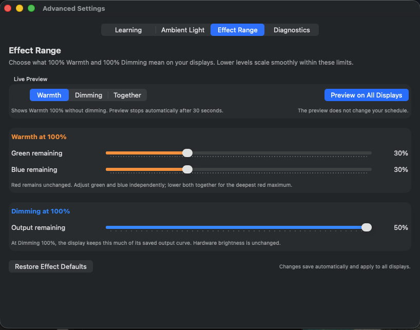

### Live Preview

Use the **Warmth**, **Dimming**, and **Together** tabs to choose which maximum effect you want to inspect, then click **Preview on All Displays**.

The preview is temporary, stops automatically after 30 seconds, and does not change your Daily Cycle schedule.

### Warmth at 100%

At maximum Warmth, the red channel remains unchanged while **Green remaining** and **Blue remaining** control how much green and blue are left in the output.

- lower **Green remaining** to remove more green and make maximum Warmth stronger;
- lower **Blue remaining** to remove more blue and make maximum Warmth stronger;
- adjust them independently to change the character of the warm tint;
- lower both together for the deepest red maximum.

These sliders define the meaning of Warmth 100%; they do not set the current Warmth level.

### Dimming at 100%

**Output remaining** controls how much of the display's saved output curve remains when ChillScreen reaches Dimming 100%.

- lower the value for a darker maximum Dimming effect;
- raise it for a gentler maximum effect.

This software Dimming range does not change the display's hardware brightness setting.

Effect Range changes save automatically and apply to all displays. Use **Restore Effect Defaults** to return these limits to their default values.

---

## 11. Diagnostics

Open **Advanced Settings → Diagnostics** to inspect the current application and display state.

**Diagnostics** provides a detailed snapshot of ChillScreen's current state for troubleshooting and bug reports.

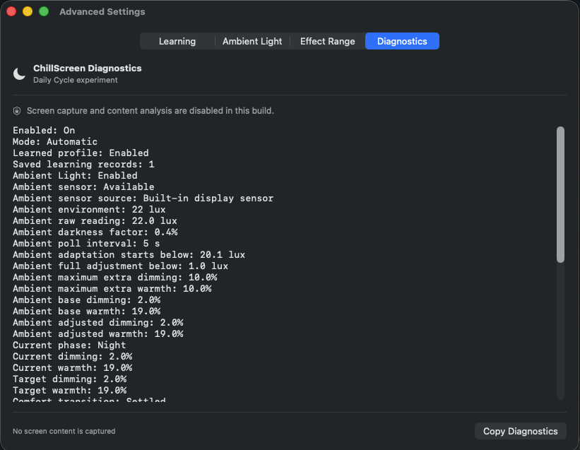

The view includes information such as:

- whether ChillScreen is enabled and which mode is active;
- whether the learned profile is enabled and how many learning records are saved;
- Ambient Light availability, selected sensor, current readings and polling interval;
- ambient-light calibration thresholds and maximum extra adjustments;
- current, base, adjusted, and target Warmth and Dimming values;
- the current phase and other internal state used to understand what ChillScreen is doing.

Use **Copy Diagnostics** to copy this information when reporting a problem. This makes it easier to provide the exact operating state without transcribing the values manually.

Screen capture and content analysis are disabled in this build, and the Diagnostics window explicitly reports that no screen content is captured.

---

## 12. Multiple Displays

ChillScreen applies the same active Warmth and Dimming targets to supported connected displays.

Each display is tracked separately so ChillScreen can safely preserve and restore its display state when the app is turned off or quits, and correctly refresh the effect after wake, lid changes, or display configuration changes.

---

## 13. Launch at Login

If **Launch at Login** is enabled, ChillScreen starts automatically when you sign in to your Mac.

This allows your daily cycle to work without manually starting the app each day.

---

## 14. Permissions and Privacy

ChillScreen does **not** capture or analyse the contents of your screen.

Location, schedule, Learning, and Ambient Light preferences are stored locally.

Location access is optional and is used to calculate sunrise and sunset. Only coordinates are stored; ChillScreen does not maintain a location history.

For the complete privacy policy, see the [Privacy Policy](privacy.md).

---

## 15. Pay What You Think It’s Worth

After two weeks, ChillScreen asks what the app has been worth to you.

You can choose any amount, including €0. Choosing €0 keeps ChillScreen fully available with every feature.

Personal use, nonprofit organizations, and government educational organizations may always choose €0.

Commercial organizations that deploy or manage ChillScreen for employees require a corporate licence. Corporate licensing information is available from **About ChillScreen**.

You can also say thanks at any time through **Buy me a coffee**.

---

## 16. Updating ChillScreen

ChillScreen does not currently update itself automatically.

1. Download the latest DMG from the GitHub **Releases** page.
2. Quit ChillScreen.
3. Replace the existing ChillScreen app in **Applications** with the new version.
4. Launch ChillScreen again.

Your schedules, Learning history, Ambient Light calibration, and other preferences are stored separately and are preserved when the application is replaced.

---

## 17. Turning ChillScreen Off

Turning ChillScreen off disables its active display effects and restores the affected displays.

ChillScreen also performs safe restoration when the app quits or when the display environment changes.

---

## 18. Troubleshooting

### macOS says ChillScreen cannot be opened

ChillScreen is currently distributed as an unsigned build.

Follow the first-launch instructions in **Getting Started**.

### The screen does not appear to change

Check that:

- ChillScreen is On;
- the current Warmth or Dimming value is above 0%;
- the selected schedule has reached its Evening period;
- the current mode contains the settings you intended to use.

### Sunrise or sunset timing looks wrong

Check that:

- Location access is enabled if you want ChillScreen to calculate local sunrise and sunset.
- macOS has the correct time zone.

### Learning controls do not appear

Make sure that ChillScreen is On, Automatic mode is selected, Learning is enabled, and the current time is inside the evening learning window.

### Ambient Light is unavailable

Some Macs expose the ambient-light sensor only while the built-in display is open and active. External displays may not provide a compatible sensor.

Open **Advanced Settings → Ambient Light**, check that at least one detected sensor is enabled, and wait for the selected polling interval. Automatic mode continues to work normally when no sensor reading is available.

### An external display behaves differently

Different displays and macOS display interfaces may support different forms of adjustment. Use **Advanced Settings → Effect Range** to preview and tune what maximum Warmth and Dimming mean on the connected displays.

### Need to report a problem

Open **Advanced Settings → Diagnostics** and use **Copy Diagnostics**. Include the copied information with your bug report together with the steps that reproduce the problem.

---

## 19. Feedback and Bug Reports

If something does not work as expected, open an Issue in the ChillScreen GitHub repository.

For a useful bug report, include:

- your macOS version;
- your Mac model;
- whether an external display is connected;
- what you expected to happen;
- what actually happened;
- steps that reproduce the problem, if known;
- copied Diagnostics information when relevant.

Do not post private location information in a public GitHub Issue.

---

## 20. Why I Built ChillScreen

I built ChillScreen because I could not find a screen tool that worked the way I wanted.

I wanted more control over bright and blue light in the evening than macOS Night Shift or the other apps I tried gave me. I wanted independent, configurable Warmth and Dimming curves, adaptation to the actual room light, and a way for the app to learn from my own adjustments.

Just as importantly, I wanted to see when these changes happen across the whole day instead of setting a timer without understanding the larger rhythm.

ChillScreen began as a tool for myself. Somewhere along the way, it became the app I had been looking for, so I decided it was worth sharing.

[Read the full story behind ChillScreen](story.md).

---

## Need more help?

ChillScreen is still evolving.

If this guide does not explain something clearly, open a GitHub Issue or send feedback so the documentation can improve along with the app.

---

## Research references

1. Cox RC et al. Distribution of dim light melatonin offset and phase relationship to waketime in healthy adults. *Sleep Health*. 2024. [Full text](https://pmc.ncbi.nlm.nih.gov/articles/PMC12693690/) · [PubMed](https://pubmed.ncbi.nlm.nih.gov/37777359/)
2. Burgess HJ et al. The relationship between the dim light melatonin onset and sleep on a regular schedule in young healthy adults. *Behavioral Sleep Medicine*. 2003. [PubMed](https://pubmed.ncbi.nlm.nih.gov/15600132/)
3. Burgess HJ, Fogg LF. Individual differences in the amount and timing of salivary melatonin secretion. *PLoS One*. 2008. [PubMed](https://pubmed.ncbi.nlm.nih.gov/18725972/)
4. Gooley JJ et al. Exposure to room light before bedtime suppresses melatonin onset and shortens melatonin duration in humans. *Journal of Clinical Endocrinology & Metabolism*. 2011. [Full text](https://pmc.ncbi.nlm.nih.gov/articles/PMC3047226/) · [PubMed](https://pubmed.ncbi.nlm.nih.gov/21193540/)
5. Wehr TA, Aeschbach D, Duncan WC. Evidence for a biological dawn and dusk in the human circadian timing system. *Journal of Physiology*. 2001. [Full text](https://pmc.ncbi.nlm.nih.gov/articles/PMC2278827/)
6. Debono M et al. Modified-release hydrocortisone to provide circadian cortisol profiles. *Journal of Clinical Endocrinology & Metabolism*. 2009. [Full text](https://pmc.ncbi.nlm.nih.gov/articles/PMC2684472/)
7. Stalder T et al. Cortisol Awakening Response: Regulation and Functional Significance. *Endocrine Reviews*. 2025. [Full text](https://academic.oup.com/edrv/article/46/1/43/7739741)
8. Stalder T et al. Evaluation and update of the expert consensus guidelines for the assessment of the cortisol awakening response. *Psychoneuroendocrinology*. 2022. [Article](https://www.sciencedirect.com/science/article/abs/pii/S0306453022002876) · [Author manuscript repository](https://cora.ucc.ie/items/05f12a96-fe61-4d1f-be02-35d2328c194b)
9. Bowles NP et al. The circadian system modulates the cortisol awakening response in humans. 2022. [PubMed](https://pubmed.ncbi.nlm.nih.gov/36408390/)
10. Reiter AM et al. Finding DLMO: estimating dim light melatonin onset from sleep markers derived from questionnaires, diaries and actigraphy. 2020. [PubMed](https://pubmed.ncbi.nlm.nih.gov/32894981/)

